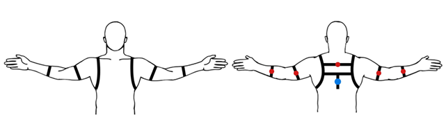
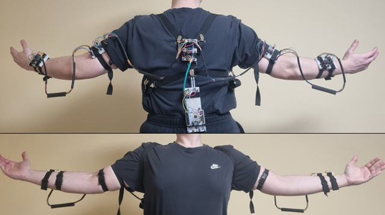
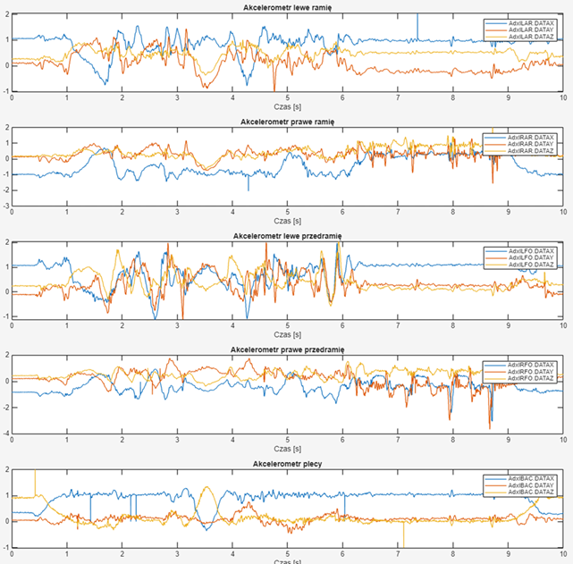
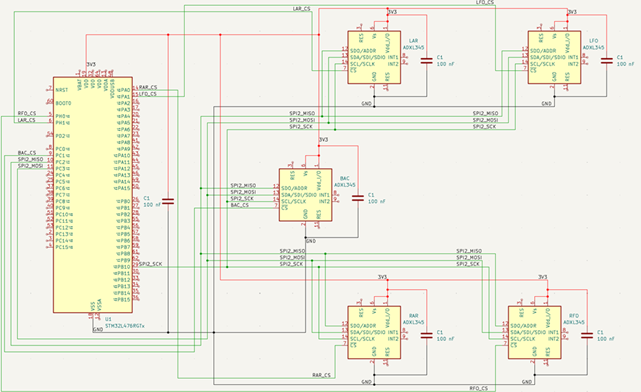

<div align="center">

# Posture Monitoring Device

**Energy-efficient wearable motion acquisition platform - STM32L476RG with five distributed ADXL345 accelerometers**

[](https://zut.edu.pl)
[](https://en.wikipedia.org/wiki/Embedded_C)
[](https://www.st.com/en/microcontrollers-microprocessors/stm32l476rg.html)
[]()

*Nominated for **Best Engineering Thesis of 2026** · Faculty of Computer Science · West Pomeranian University of Technology · Result pending (2027)*

</div>

---

## Summary of Key Results

| Metric | Value |
|--------|-------|
| MCU | STM32L476RG - ARM Cortex-M4F, 80 MHz |
| Accelerometers | 5 × ADXL345 - triaxial, SPI, ±16 g |
| Average current: baseline | 14.0 mA |
| Average current: final | **4.3 mA (−69%)** |
| Battery life: baseline | 7 days |
| Battery life: final | **22 days (+226%)** |
| UART throughput | 921 600 baud, DMA-backed |
| Firmware architecture | Bare-metal, event-driven |

---

## Technology Stack

### Language and Code Quality

| Area | Detail |
|------|--------|
| Language standard | Embedded C|
| Driver design | Hardware-independent C - OOP-oriented patterns via struct composition and function-pointer dispatch |
| Coding standard | MISRA C:2012 - enforced via Cppcheck
| Testing | CppUTest, CppUMock, Unity
### Software Engineering
 
The firmware applies SOLID principles, DRY, dependency injection, and dependency inversion throughout. The ADXL345 driver is structured around the Strategy, Hardware Abstraction Layer, and Facade patterns - with a layered architecture that enforces a clean boundary between driver logic and platform-specific code.
### Static Analysis

| Tool | Scope |
|------|-------|
| Cppcheck + MISRA C:2012 addon | `adxl345.c`, `main.c` - full ruleset |


### Dynamic Analysis and Testing

| Tool / Technique | Purpose |
|-----------------|---------|
| GCC `--coverage` + gcovr | Code coverage instrumentation and HTML/XML reporting |
| CppUTest | Host-side unit testing of driver logic - no target hardware required |
| Fakes, Spies, Mocks | `fakeSTM.c`, `adxl345spy.c`, `mockSTM.c` - full isolation of ADXL345 driver under test |
| DWT cycle counter | Runtime CPU cycle profiling on Cortex-M4 via `DWT->CYCCNT` |
| Current measurement | Physical ammeter readings at each optimisation stage |

---

## Project Overview

The device is a wearable platform for real-time body posture monitoring during physical exercises. Five ADXL345 accelerometers are distributed across the user's body - left arm (LAR), right arm (RAR), left forearm (LFO), right forearm (RFO), and back (BAC) - providing full upper-body motion coverage. Raw triaxial acceleration data is continuously acquired, packed into a semicolon-delimited frame of 15 values, and streamed at 921 600 baud to a companion desktop application that performs exercise classification and posture feedback.

The firmware was engineered with a production mindset: hardware-independent drivers, layered architecture, dependency injection, MISRA C:2012 compliance, and a host-side test suite validated by code coverage.

---

## Firmware Architecture

The firmware is a fully event-driven, bare-metal application. The CPU remains in sleep mode for the majority of runtime, waking exclusively on hardware interrupts. Two WFI (Wait For Interrupt) entry points are present in the main loop: one after UART DMA transmission is dispatched, and one as the idle fallback - the CPU never spins.

The acquisition cycle is RTC-gated. The RTC is driven from the LSE (Low-Speed External 32.768 kHz crystal), the lowest-power clock source on the STM32L4, consuming negligible current while the rest of the device sleeps.

Peripheral access is fully DMA-backed: SPI transfers to each ADXL345 sensor and UART transmission to the host are both non-blocking and interrupt-driven, with the CPU returning to sleep immediately after dispatching a transfer.

Execution flow per cycle:

1. RTC wakeup interrupt fires (LSE-clocked timer)
2. All five ADXL345 sensors are read sequentially via SPI DMA
3. 15 acceleration values (X, Y, Z per sensor) are formatted into a frame
4. Frame is transmitted over UART2 at 921 600 baud via DMA
5. CPU enters sleep mode (WFI) pending the UART DMA completion callback
6. CPU re-enters sleep mode pending the next RTC wakeup

---

## Hardware Abstraction and Driver Design

The ADXL345 driver (`adxl345.c`) has zero compile-time coupling to any hardware. It communicates exclusively through a user-supplied interface struct of function pointers:

```c
typedef struct {
    write_fn          write;          /* SPI transmit      */
    read_fn           read;           /* SPI transceive    */
    ERR_RuntimeError  err_runtime;    /* error callback    */
} ADXL345Interface;
```

The STM32-specific implementation (`stm32_adxl345.c`) fulfils this contract with HAL SPI DMA calls and is injected at startup via `GetSTM32Interface()`. The driver itself is unaware of STM32, HAL, or any platform concept.

This pattern makes three things possible:

- The driver compiles and runs on a host PC for testing with no HAL or hardware present
- A future platform port requires only a new implementation of `ADXL345Interface`
- CppUTest tests target the interface contract directly, using fakes and spies in place of real hardware

---

## Power Consumption Optimisation

Average current was reduced from **14.0 mA to 4.3 mA** across five successive, independently measured stages. [1]

| Average Current [mA] | Battery Life [h] | Battery Life [days] | Improvement [%] | Optimisation Applied |
|---------------------|------------------|---------------------|-----------------|---------------------|
| 14.0 | 164 | 7.0 | - | Baseline configuration |
| 11.8 | 195 | 8.0 | 16 | CPU sleep during UART transfers |
| 8.0 | 287 | 12.0 | 43 | Burst acquisition duty cycle |
| 5.8 | 396 | 16.5 | 59 | MCU clock frequency reduction |
| 4.3 | 535 | 22.0 | 69 | Low-power clock source migration |

Baseline battery capacity: 2300 mAh.

---

## Project Scope

The complete system spans four independent components:

**MATLAB Research Environment** - signal analysis, algorithm prototyping, and exercise classification development.

**Embedded Firmware** (this repository) - bare-metal C, STM32L476RG, event-driven acquisition, DMA-accelerated data path.

**Host Test Suite** - CppUTest-based, hardware-independent verification of driver and application logic using mocks, fakes, and spies; code coverage via gcovr.

**Qt Widgets Desktop Application (C++)** - cross-platform posture visualisation, exercise monitoring, data analysis, and system administration; contains the ported classification algorithm.

---

## System Images

| | |
|---|---|
|  |  |
| Device prototype | Sensor nodes positioned on user |
|  |  |
| Live accelerometer readings | Hardware architecture - KiCad |

---

## Reference

[1] Michał Chmielczyk - *Design of an Application and an Energy-Efficient Device for Monitoring Correct Body Posture During Physical Exercises* - Szczecin, 2026